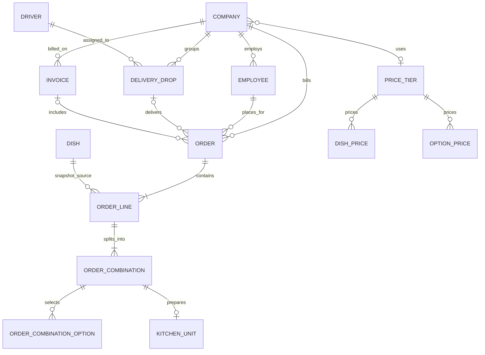

# Heizen Kitchen Operations

An internal operations application with a Next.js App Router frontend and a NestJS API. The browser communicates with the API over HTTP; authentication uses the backend's HTTP-only access-token cookie.

## Requirements

- Node.js 20+
- npm
- A PostgreSQL database configured for the backend

## Local setup

Install dependencies in both applications:

```powershell
Set-Location backend
npm install
npx prisma generate
```

Configure `backend/.env` using `backend/.env.example`, including a valid PostgreSQL `DATABASE_URL`, JWT secret, and `FRONTEND_URL=http://localhost:3000`. Apply the project's migrations from `backend` with `npx prisma migrate deploy`.

For Supabase, keep `DATABASE_URL` as the app's runtime connection if it uses the transaction pooler (port `6543`), and optionally set `DIRECT_URL` to a direct PostgreSQL or session-pooler connection for Prisma CLI migrations. The Prisma CLI prefers `DIRECT_URL` when it is set because transaction pooling may not support Prisma's migration advisory lock. If no separate direct connection is needed, `DIRECT_URL` can be omitted.

Configure the frontend:

```powershell
Set-Location ..\frontend
npm install
Copy-Item .env.local.example .env.local
```

`NEXT_PUBLIC_API_URL` should contain the NestJS origin (default `http://localhost:3001`).

Run the backend and frontend in separate terminals:

```powershell
Set-Location backend
npm run start:dev
```

```powershell
Set-Location frontend
npm run dev
```

Open `http://localhost:3000`. The backend API is served under `/api`. Set the backend's `FRONTEND_URL` to the frontend origin because cookie-based authentication requires credentialed CORS.

## Frontend validation

```powershell
Set-Location frontend
npm run lint
npm run typecheck
npm run build
```

## Backend validation

```powershell
Set-Location backend
npx prisma validate
npm run build
npx vitest run
```

## Supported frontend workflows

- Login, logout, session restoration, and role-specific route/navigation handling for `ADMIN`, `KITCHEN`, `DISPATCH`, and `DRIVER`.
- Admin: server-filtered and offset-paginated orders, full order details/status timeline, draft/placed/confirmed-order cancellation with retained history, placed-order rejection, confirmed-order overrides, guided multi-line and multi-combination quote-before-submit order creation, staff account creation with role assignment, company/employee directory maintenance including multiple delivery addresses and row-level CSV employee import, company and kitchen holidays, configurable kitchen stations and reusable portion-size reference data, catalogue/category/dish/option/group management with explicit dish ordering, menu preview, dish/option tier-price overrides, billing candidates, invoice listing/detail/creation/payment, manual idempotent cut-off processing, and a confirmed-order kitchen force-completion escalation.
- Kitchen: date/station/unit-status filtering using the active admin-managed kitchen stations, backend-defined prep units, and start/complete actions.
- Dispatch: backend grouping of kitchen-ready orders, company-compatible driver selection with current/future active-drop counts, dispatch-ready and out-for-delivery transitions.
- Driver: authenticated driver's today-only drop list (including assigned drops not yet dispatch-ready), drop detail with delivery instructions and packaging, optional delivery note/photo URL, and delivery completion.

All business data, price resolution, validation, quote totals, invoice totals, authorization, and mutations are obtained from NestJS. The frontend does not calculate authoritative money amounts. Drivers can record a photo URL; binary photo upload and storage are not configured.

## Dashboard definitions

- **Admin:** `GET /api/admin/dashboard/summary?deliveryDate=YYYY-MM-DD` is an admin-only, server-calculated summary for the selected delivery date (defaulting to today in `Asia/Kolkata`). Kitchen prep counts only units belonging to confirmed orders for that delivery date; `atRiskOrders` counts confirmed orders with a planned kitchen-ready timestamp before the summary generation time and no actual kitchen-ready timestamp. Dispatch drop figures are drops for that date; a late delivery is a delivered drop whose `deliveredOnTime` value is `false`; an unassigned drop has no driver. Billing figures are all confirmed, uninvoiced orders regardless of delivery date, and the amount is their exact decimal sum. Catalogue counts are active dishes and active categories. Cancelled, draft, placed, rejected, and delivered orders do not count toward billing attention. The upcoming-order table remains a short operational queue, not a metric.
- **Kitchen:** the board uses the selected `deliveryDate` (defaulting to the current date in `Asia/Kolkata`) and the prep-unit collection returned by `GET /api/kitchen/orders`. Only confirmed orders with matching backend-created kitchen units are included. Completed and incomplete unit counts are per returned order and come from the backend's progress object. Cancelled orders are excluded by the backend. The `isAtRisk` flag and planned ready time are rendered as returned; the frontend does not calculate lateness.
- **Dispatch:** the board uses the selected delivery calendar date (default `Asia/Kolkata`) and backend drop records returned by `GET /api/dispatch/drops`. Driver workload is the count of that driver's undelivered drops whose delivery date is today or later, returned by `GET /api/dispatch/drivers`. Drop order count, readiness, driver, status, on-time state, and timestamps come from API responses. Cancelled orders are absent from backend-created drops.
- **Driver:** the dashboard lists only records returned by `GET /api/driver/drops/today`, which scopes by the authenticated driver identity and the current `Asia/Kolkata` date. It sorts cards in the backend's delivery-time/id order. Delivered drops remain visible for today's list; other drivers' records are rejected by the backend. The UI does not derive its own delivery count beyond the returned drop `orderCount`.
- Orders are filtered and paginated server-side; the list endpoint currently returns an array without total-count metadata.
- Binary photo upload remains unavailable until a storage provider, upload route, access policy, and URL lifecycle are configured. Drivers may record a validated externally hosted photo URL and a delivery note.
- Invoice list filters and pagination are server-side: company, status, issued-date range, paid-date range, `limit`, and `offset`. Date boundaries are evaluated in `Asia/Kolkata`; an end date includes that whole local calendar day.

## Architecture and data model

- **Frontend:** Next.js App Router + React + TypeScript. A centralized browser HTTP client calls NestJS under `/api`; the app does not use Server Actions for business requests.
- **Authentication:** NestJS issues an HTTP-only access-token cookie. The browser uses `credentials: include`, restores the session through `/api/auth/me`, and sends unauthenticated users to the login route. UI role guards improve navigation, while NestJS guards remain authoritative.
- **Backend:** NestJS controllers, DTO validation, role guards, domain services, and Prisma. Monetary snapshots are returned as decimal strings and displayed as such. Cut-off and driver “today” calculations use `Asia/Kolkata`.
- **State:** screen-level React state and re-fetches after successful workflow mutations; no additional client-state or fetching dependency was introduced.

Core relationships represented in the current Prisma schema:



The schema includes company email-domain ownership and addresses, per-company hidden categories/dishes and holidays, employee delivery permissions/allergies/dietary preferences, option allergens/tags, admin-managed reusable portion-size references with per-option prices, admin-managed kitchen station references, kitchen calendar settings, price matrices, and immutable order-line/combination/option/portion snapshots. Role authorization and company-domain checks are enforced by the API; UI visibility is not treated as an authorization boundary.

## Prioritisation and interpretation

**Built:** role-specific operational boards; admin staff-account creation and role assignment; order search/filters/timeline/overrides, cancellation/rejection, and multi-line/multi-combination quote-before-submit; company/employee management, multiple delivery addresses, CSV import with row-level errors, and holidays; admin-managed kitchen stations and portion-size references; catalogue with category and dish ordering, menu preview, and direct staff access to secret categories; pricing override grids; configurable per-option portion prices; kitchen calendar settings and admin kitchen force-completion escalation; invoice workflow; compatible driver assignment and driver-only delivery completion with optional note/photo URL.

**Not included:** production deployment and production/live review accounts, and binary photo upload. Deployment and live credentials are intentionally left to the submitter; the local seed accounts are not live review credentials. Do not describe a production environment or uploaded delivery photos as verified unless configured and checked separately.

**Ambiguities:** the kitchen timezone is interpreted as `Asia/Kolkata`, following the backend calendar utilities. The invoice policy is that a created invoice remains immutable and payable only through `ISSUED → PAID`; no adjustment/credit-note endpoint exists. A cut-off run processes only eligible rows whose stored `cutoffAt` is at or before the backend's current time, even when a past delivery date is selected. Cut-offs are checked at service startup and every minute, as well as through the manual admin action.

## Deployment and review data

No live deployment URL or production database credentials are configured in this workspace. For local demonstrations, run `npm run prisma:seed` from `backend` after applying migrations. The seed creates ten sample companies with five employees each, 15 menu dishes priced in INR, and 20 workflow examples. It also creates ten confirmed, driver-assigned orders for each calendar day from today through 15 days ahead in `Asia/Kolkata` (160 rolling orders, 180 seed orders total). The rolling orders use varied dishes, employees, quantities, delivery times, and company drivers so the admin, kitchen, dispatch, and driver workflows have data throughout that window. Re-seeding preserves matching orders that have already been invoiced. Sample company names are illustrative and are not affiliated with those organizations; employee email addresses use the reserved `.demo.example` domain.

The default local password is `Test@1234`; set `SEED_PASSWORD` before seeding to choose another. Core accounts are `admin@test.com`, `kitchen@test.com`, `dispatch@test.com`, and `driver@test.com`. Additional sample driver accounts are `driver.microsoft@test.com`, `driver.amazon@test.com`, `driver.infosys@test.com`, and `driver.tcs@test.com`. This seed data is for local review only and does not constitute production or hosted review credentials.
